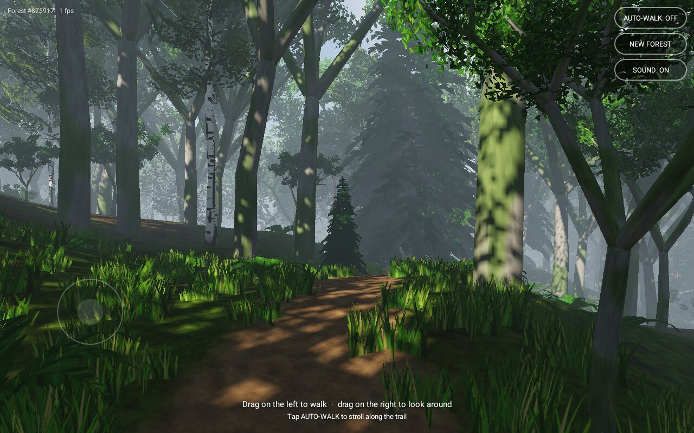
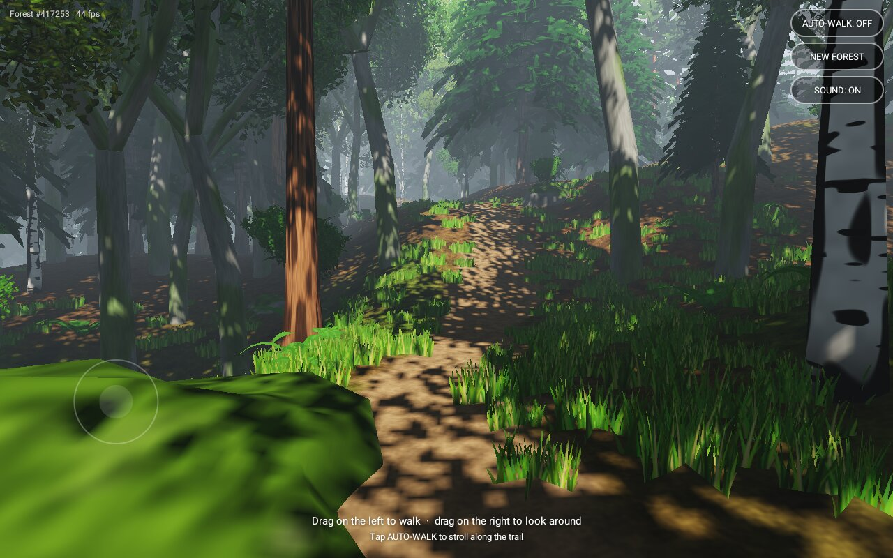

# Forest Walk 🌲

A procedurally generated, realistic first-person walk through an endless forest for Android.

**[⬇ Download the latest APK](https://github.com/z1fire/forest-walk/releases/latest/download/ForestWalk.apk)**




Every forest is generated from a seed: rolling terrain, a winding dirt trail, and stands of
spruce, pine, beech and birch with saplings, ferns, grass and mossy boulders. Walk anywhere,
the world streams in around you forever, or let auto-walk carry you along the trail.

## Features

- **Infinite procedural world**: simplex-noise terrain streamed in 32 m chunks around you, with a trail that meanders through valleys and over hills.
- **Four procedurally built tree species** with near and far detail levels, generated per seed. Foliage textures (needle sprays, leaf clusters, fern fronds, grass) are painted procedurally at startup, so the APK contains no image assets.
- **Realistic lighting**: real-time sun shadows with dappled light through the canopy, leaf translucency, hemispheric ambient light, distance haze, drifting clouds, ACES tone mapping and 4x MSAA with alpha-to-coverage foliage.
- **Living scene**: wind gusts sway trees, grass and ferns.
- **Synthesised ambient audio**: wind, rustling leaves, birdsong with echo, and footsteps on leaf litter.

## Controls

| Action | Gesture |
| --- | --- |
| Walk | Drag anywhere on the left side of the screen (floating joystick) |
| Look around | Drag on the right side |
| Auto-walk along the trail | Tap **AUTO-WALK** |
| Generate a different forest | Tap **NEW FOREST** |
| Mute / unmute | Tap **SOUND** |

## Install

1. Download `ForestWalk.apk` from the [latest release](https://github.com/z1fire/forest-walk/releases/latest).
2. Open it on your phone. If prompted, allow installing apps from your browser or file manager.

Requires Android 8.0+ and OpenGL ES 3.0 (virtually every phone from the last several years).

## Building

The app is plain Java + OpenGL ES 3.0 with no third-party dependencies.

```sh
./gradlew assembleRelease     # needs JDK 17 and the Android SDK
```

GitHub Actions builds every push; pushing a `v*` tag publishes a release with the signed APK attached.
